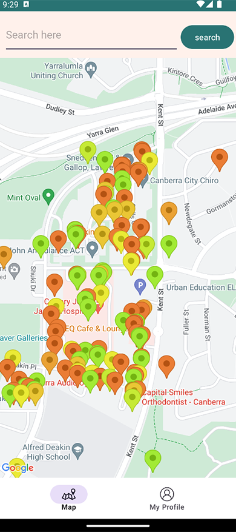

# [G0 - Team Name] Report

The following is a report template to help your team successfully provide all the details necessary for your report in a structured and organised manner. Please give a straightforward and concise report that best demonstrates your project. Note that a good report will give a better impression of your project to the reviewers.

Note that you should have removed ALL TEMPLATE/INSTRUCTION textes in your submission (like the current sentence), otherwise it hampers the professionality in your documentation.

*Here are some tips to write a good report:*

* `Bullet points` are allowed and strongly encouraged for this report. Try to summarise and list the highlights of your project (rather than give long paragraphs).*

* *Try to create `diagrams` for parts that could greatly benefit from it.*

* *Try to make your report `well structured`, which is easier for the reviewers to capture the necessary information.*

*We give instructions enclosed in square brackets [...] and examples for each sections to demonstrate what are expected for your project report. Note that they only provide part of the skeleton and your description should be more content-rich. Quick references about markdown by [CommonMark](https://commonmark.org/help/)*

## Table of Contents

1. [Team Members and Roles](#team-members-and-roles)
2. [Summary of Individual Contributions](#summary-of-individual-contributions)
3. [Application Description](#application-description)
4. [Application UML](#application-uml)
5. [Application Design and Decisions](#application-design-and-decisions)
6. [Summary of Known Errors and Bugs](#summary-of-known-errors-and-bugs)
7. [Testing Summary](#testing-summary)
8. [Implemented Features](#implemented-features)
9. [Team Meetings](#team-meetings)
10. [Conflict Resolution Protocol](#conflict-resolution-protocol)

## Administrative
- Firebase Repository Link: <insert-link-to-firebase-repository>
   - Confirm: I have already added comp21006442@gmail.com as a Developer to the Firebase project prior to due date.
- Two user accounts for markers' access are usable on the app's APK (do not change the username and password unless there are exceptional circumstances. Note that they are not real e-mail addresses in use):
   - Username: comp2100@anu.edu.au	Password: comp2100
   - Username: comp6442@anu.edu.au	Password: comp6442

## Team Members and Roles
The key area(s) of responsibilities for each member

| UID        |      Name      |          Role |
|:-----------|:--------------:|--------------:|
| [u7776180] |  [Hongyu Li]   | [Team member] |
| [u7757949] | [Juliang Xiao] | [Team member] |
| [u7671098] | [Yujing Zhang] | [Team member] |
| [u7785177] |  [Xinfei Li]   | [Team member] |
| [u7728429] | [Xinrui Zhang] | [Team member] |

## Summary of Individual Contributions

Specific details of individual contribution of each member to the project.

Each team member is responsible for writing **their own subsection**.

A generic summary will not be acceptable and may result in a significant lose of marks.

*[Summarise the contributions made by each member to the project, e.g. code implementation, code design, UI design, report writing, etc.]*

*[Code Implementation. Which features did you implement? Which classes or methods was each member involved in? Provide an approximate proportion in pecentage of the contribution of each member to the whole code implementation, e.g. 30%.]*

*you should ALSO provide links to the specified classes and/or functions*
Note that the core criteria of contribution is based on `code contribution` (the technical developing of the App).

*Here is an example: (Note that you should remove the entire section (e.g. "others") if it is not applicable)*

1. **u7776180, Hongyu Li**  I have 20% contribution, as follows:  
  - **Code Contribution in the final App**
    - Feature A1, A2, A3 - class Dummy: [Dummy.java](https://gitlab.cecs.anu.edu.au/comp2100/group-project/ga-23s2/-/blob/main/items/media/_examples/Dummy.java)
    - XYZ Design Pattern -  class AnotherClass: [functionOne()](https://gitlab.cecs.anu.edu.au/comp2100/group-project/ga-23s2/-/blob/main/items/media/_examples/Dummy.java#L22-43), [function2()](the-URL)
    - ... (any other contribution in the code, including UI and data files) ... [Student class](../src/path/to/class/Student.java), ..., etc.*, [LanguageTranslator class](../src/path/to/class/LanguageTranslator.java): function1(), function2(), ...   

  - **Code and App Design** 
    - [What design patterns, data structures, did the involved member propose?]*
    - [UI Design. Specify what design did the involved member propose? What tools were used for the design?]*   

  - **Others**: (only if significant and significantly different from an "average contribution") 
    - [Report Writing?] [Slides preparation?]*
    - [You are welcome to provide anything that you consider as a contribution to the project or team.] e.g., APK, setups, firebase*   

2. **U7785177, Xinfei Li**  I have 20% contribution, as follows:  
- **Code Contribution in the final App**
    - Feature Login - [Link to Login Feature](#Basic-Features)
    - Factory Design Pattern - [Link to Factory Pattern](#factory-pattern)
    - Dwelling Material class - [BuildingMaterial.java](https://gitlab.cecs.anu.edu.au/u7757949/gp-24s1/-/blob/main/MyApplication/app/src/main/java/helper_classes_and_methods/BuildingMaterial.java?ref_type=heads)
    - Seismic Rating method - [Class Dwelling Method getSeismicRating](https://gitlab.cecs.anu.edu.au/u7757949/gp-24s1/-/blob/main/MyApplication/app/src/main/java/helper_classes_and_methods/Dwelling.java?ref_type=heads#L155-182)
    - repair and needsRepair method - [Class Dwelling Method needsRepair](https://gitlab.cecs.anu.edu.au/u7757949/gp-24s1/-/blob/main/MyApplication/app/src/main/java/helper_classes_and_methods/Dwelling.java?ref_type=heads#L89-122) and [Class Dwelling Method repair](https://gitlab.cecs.anu.edu.au/u7757949/gp-24s1/-/blob/main/MyApplication/app/src/main/java/helper_classes_and_methods/Dwelling.java?ref_type=heads#L123-148)

3. **u7671098, Yujing Zhang**  I have 20% contribution, as follows:  
- **Code Contribution in the final App**
    - GPS function - class MapActivity: [viewCurrentLocation()](https://gitlab.cecs.anu.edu.au/u7757949/gp-24s1/-/blob/main/MyApplication/app/src/main/java/com/example/myapplication/MapActivity.java?ref_type=heads#L329-366)
    - show Data(the way to mark on the map) -  class MapActivity: [addMarkers()，addOneMarker(),getHueFromColorType()](https://gitlab.cecs.anu.edu.au/u7757949/gp-24s1/-/blob/main/MyApplication/app/src/main/java/com/example/myapplication/MapActivity.java?ref_type=heads#L374-413)
    - profile page and user page(display):[activity_prof_page.xml](https://gitlab.cecs.anu.edu.au/u7757949/gp-24s1/-/blob/main/MyApplication/app/src/main/res/layout-land/activity_prof_page.xml?ref_type=heads), [activity_user.xml](https://gitlab.cecs.anu.edu.au/u7757949/gp-24s1/-/blob/main/MyApplication/app/src/main/res/layout-land/activity_user.xml?ref_type=heads)
    - UI Landscape: [activity_login.xml(land)](https://gitlab.cecs.anu.edu.au/u7757949/gp-24s1/-/blob/main/MyApplication/app/src/main/res/layout-land/activity_login.xml?ref_type=heads), [activity_main.xml(land)](https://gitlab.cecs.anu.edu.au/u7757949/gp-24s1/-/blob/main/MyApplication/app/src/main/res/layout-land/activity_main.xml?ref_type=heads), [activity_prof_page(land)](https://gitlab.cecs.anu.edu.au/u7757949/gp-24s1/-/blob/main/MyApplication/app/src/main/res/layout-land/activity_prof_page.xml?ref_type=heads),[activity_user(land)](https://gitlab.cecs.anu.edu.au/u7757949/gp-24s1/-/blob/main/MyApplication/app/src/main/res/layout-land/activity_user.xml?ref_type=heads)

- **Code and App Design**
    - UI Design: Adjusting the pages layout, Theme color,images [Launch icon](https://gitlab.cecs.anu.edu.au/u7757949/gp-24s1/-/blob/main/MyApplication/app/src/main/res/drawable/app_logo.png?ref_type=heads),tools:Sketch,Photoshop]*   

- **Others**: (only if significant and significantly different from an "average contribution")
    - [Report Writing?] [Slides preparation?]*
    - [You are welcome to provide anything that you consider as a contribution to the project or team.] e.g., APK, setups, firebase*   

4. **u7728429, Xinrui Zhang**  I have 22% contribution, as follows:  
- **Code Contribution in the final App**
    - Load data from local file and save data to json file - class DataLoader: [DataLoader.java](https://gitlab.cecs.anu.edu.au/u7757949/gp-24s1/-/blob/main/MyApplication/app/src/main/java/helper_classes_and_methods/DataLoader.java?ref_type=heads)
    - parser - class ExpressionParser: [ExpressionParser.java](https://gitlab.cecs.anu.edu.au/u7757949/gp-24s1/-/blob/main/MyApplication/app/src/main/java/helper_classes_and_methods/parser/ExpressionParser.java?ref_type=heads)
    - tokenizer - class Tokenizer: [Tokenizer.java](https://gitlab.cecs.anu.edu.au/u7757949/gp-24s1/-/blob/main/MyApplication/app/src/main/java/helper_classes_and_methods/parser/Tokenizer.java?ref_type=heads)
    - fuzzy search - class MapActivity: [showListPopupWindow()](https://gitlab.cecs.anu.edu.au/u7757949/gp-24s1/-/blob/main/MyApplication/app/src/main/java/com/example/myapplication/MapActivity.java?ref_type=heads#L165-189)
    
- **Code and App Design**
    - data structures: part of B-tree searching function [B-tree search](https://gitlab.cecs.anu.edu.au/u7757949/gp-24s1/-/blob/main/MyApplication/app/src/main/java/helper_classes_and_methods/BTree.java?ref_type=heads#L380-406),tools:Android studio]*   

- **Others**: (only if significant and significantly different from an "average contribution")
    - [Report Writing?] [Slides preparation?]*
    - [You are welcome to provide anything that you consider as a contribution to the project or team.] e.g., APK, setups, firebase*   

5. **UID2, Name2**  I have xx% contribution, as follows:  
- ...
- 
## Application Description

[//]: # (*[What is your application, what does it do? Include photos or diagrams if necessary]*)

[//]: # (*Here is a pet specific application example*)

*The inspiration for My Dwelling comes from the idea that 'Sustainable development is about the way urban spaces are built and managed.
' The objective is to offer a safe dwelling map for an area or city, which will display the seismic level 0-10 (red to green) of each building on the map. 
This will be beneficial for areas likely to be impacted by earthquakes, supporting local governments in making decisions about city planning.
Local residents will also benefit from this app because it provides fire alarm notifications for dwellings, which improves community safety. 
For community managers, the app provides automatic notifications for repairs based on multiple parameter calculations and the function to report the fire alarm as well.*

### Application Use Cases and or Examples

[//]: # (*[Provide use cases and examples of people using your application. Who are the target users of your application? How do the users use your application?]*)

[//]: # (*Here is a pet training application example*)

*Molly wants to inquiry about her cat, McPurr's recent troublesome behaviour*
1. *Molly notices that McPurr has been hostile since...*
2. *She makes a post about... with the tag...*
3. *Lachlan, a vet, writes a reply to Molly's post...*
4. ...
5. *Molly gives Lachlan's reply a 'tick' response*

*Here is a map navigation application example*

*Target User: Residents*

* *Users can view the current street, follow the buildings they care about.*
* *receive fire alarm notifications*
* *and view the login and notifications log*

*target user: building managers*

* *Can view if the building need repairs, the app provides automatic notifications for repairs based on multiple parameter calculations*
* *Sent fire alarm to the subscriber*...

*target user: local government/communities*
* *view the building on the map.*
* *view the visual seismic ‘color’ of each building, allowing officials to monitor specific buildings or areas. These data help officials in urban planning and emergency management decisions, such as determining which buildings need reinforcement or reconstruction.*

[//]: # (*List all the use cases in text descriptions or create use case diagrams. Please refer to https://www.visual-paradigm.com/guide/uml-unified-modeling-language/what-is-use-case-diagram/ for use case diagram.*)

 

### Application UML

  
*[Replace the above with a class diagram. You can look at how we have linked an image here as an example of how you can do it too.]*

## Code Design and Decisions

This is an important section of your report and should include all technical decisions made. Well-written justifications will increase your marks for both the report as well as for the relevant parts (e.g., data structure). This includes, for example,

- Details about the parser (describe the formal grammar and language used): We use tokenizers and parsers in searching function. The parser and tokenizer first split an input string into tokens and return a list of tokens containing all the tokens, and then parse the tokens to generate an expression object, where the input string follows the and(x:xxx,or(x:xxx,not(x:xxx))) format.

- Decisions made (e.g., explain why you chose one or another data structure, why you used a specific data model, etc.)

- Details about the design patterns used (where in the code, justification of the choice, etc)

*Please give clear and concise descriptions for each subsections of this part. It would be better to list all the concrete items for each subsection and give no more than `5` concise, crucial reasons of your design.

### Data Structures

*[What data structures did your team utilise? Where and why?]*

Here is a partial (short) example for the subsection `Data Structures`:*

*I used the following data structures in my project:*

1. *LinkedList*
   * *Objective: used for storing xxxx for xxx feature.*
   * *Code Locations: defined in [Class X, methods Z, Y](https://gitlab.cecs.anu.edu.au/comp2100/group-project/ga-23s2/-/blob/main/items/media/_examples/Dummy.java#L22-43) and [class AnotherClass, lines l1-l2](url); processed using [dataStructureHandlerMethod](url) and ...
   * *Reasons:*
      * *It is more efficient than Arraylist for insertion with a time complexity O(1)*
      * *We don't need to access the item by index for xxx feature because...*
      * For the (part), the data ... (characteristics) ...

2. ...

3. ...

### Design Patterns
*[What design patterns did your team utilise? Where and why?]*

1. *xxx Pattern*
   * *Objective: used for storing xxxx for xxx feature.*
   * *Code Locations: defined in [Class X, methods Z, Y](https://gitlab.cecs.anu.edu.au/comp2100/group-project/ga-23s2/-/blob/main/items/media/_examples/Dummy.java#L22-43) and [class AnotherClass, lines l1-l2](url); processed using [dataStructureHandlerMethod](url) and ...
   * *Reasons:*
      * ...
1. *Factory Pattern*
    * *Objective: used for storing and loading login and fire alarm history for LoadShowData feature.*
    * Code Locations: Interface: [Interface StorageHandler](https://gitlab.cecs.anu.edu.au/u7757949/gp-24s1/-/blob/main/MyApplication/app/src/main/java/helper_classes_and_methods/StorageHandler.java) 
    * Helper class: [TimeUtil.java](https://gitlab.cecs.anu.edu.au/u7757949/gp-24s1/-/blob/main/MyApplication/app/src/main/java/helper_classes_and_methods/TimeUtil.java); 
    * 2 Handler: [FireAlarmStorageHandler.java](https://gitlab.cecs.anu.edu.au/u7757949/gp-24s1/-/blob/main/MyApplication/app/src/main/java/helper_classes_and_methods/FireAlarmStorageHandler.java);
    * and [LoginStorageHandler.java](https://gitlab.cecs.anu.edu.au/u7757949/gp-24s1/-/blob/main/MyApplication/app/src/main/java/helper_classes_and_methods/LoginStorageHandler.java);
    * Factory: [StorageFactory.java](https://gitlab.cecs.anu.edu.au/u7757949/gp-24s1/-/blob/main/MyApplication/app/src/main/java/helper_classes_and_methods/StorageFactory.java);
    * Record logs in [ProfPageActivity.java line 29, 47 and 149](https://gitlab.cecs.anu.edu.au/u7757949/gp-24s1/-/blob/main/MyApplication/app/src/main/java/com/example/myapplication/ProfPageActivity.java) 
    * and [LoginActivity.java.java line 35, 51 and 64](https://gitlab.cecs.anu.edu.au/u7757949/gp-24s1/-/blob/main/MyApplication/app/src/main/java/com/example/myapplication/LoginActivity.java)
    * Present the history in [UserActivity.java line 48-65](https://gitlab.cecs.anu.edu.au/u7757949/gp-24s1/-/blob/main/MyApplication/app/src/main/java/com/example/myapplication/UserActivity.java?ref_type=heads#L48-65)
    * *Reasons:*
        * Scalable Logging: Easily add more local logs as needed.
        * Local Storage: Keeps login and fire alarm history on-device for better activity tracking.
        * Persistent Logs: Maintains logs across restarts, ensuring data isn't lost, enhancing system reliability and historical data accessibility.
          
          

### Parser

### <u>Grammar(s)</u>
*I modeled the design after the parser method on lection.The and and or statements require two key-value pairs separated by commas, while the not statement has only one key-value pair.*

Production Rules:

    and(key:value,key:value)
    or(key:value,key:value)
    not(key:value)
    for example: and(fireAlarm:"false",not(buildingMaterial:"wood"))

### <u>Tokenizers and Parsers</u>

We use tokenizers and parsers in searching function. The parser and tokenizer first split an input string into tokens and return a list of tokens containing all the tokens, and then parse the tokens to generate an expression object, where the input string follows the and(x:xxx,or(x:xxx,not(x:xxx))) format. It can be very useful when searching particular dwellings.

### Others

*[What other design decisions have you made which you feel are relevant? Feel free to separate these into their own subheadings.]*

 

## Implemented Features
*[What features have you implemented? where, how, and why?]*  
*List all features you have completed in their separate categories with their featureId. THe features must be one of the basic/custom features, or an approved feature from Voice Four Feature.*

### Basic Features
1. [LogIn]. Users must be able to log in (not necessarily sign up). (easy)
   * Code: [Class User, method validateUserCredentials](https://gitlab.cecs.anu.edu.au/u7757949/gp-24s1/-/blob/main/MyApplication/app/src/main/java/helper_classes_and_methods/User.java?ref_type=heads#L142-189) and [Class UserActivity](https://gitlab.cecs.anu.edu.au/u7757949/gp-24s1/-/blob/main/MyApplication/app/src/main/java/com/example/myapplication/UserActivity.java?ref_type=heads)
   * Feature: User can log in different username and password, mismatched username and password will not allow to login   
   * Implementation:  User input username and password in Class UserActivity. Then use Class User, method validateUserCredentials to validate the user information. After successful login, turn to MapActivity page. 

2. [DataFiles]. Description  ... ... (...)
   * Code to the Data File [users_interaction.json](link-to-file), [search-queries.xml](link-to-file), ...
   * Link to the Firebase repo: ...

3. ...
    

### Custom Features
Feature Category: Privacy  
1. [Privacy-Request]. Description of the feature  (easy)
   * Code: [Class X, methods Z, Y](https://gitlab.cecs.anu.edu.au/comp2100/group-project/ga-23s2/-/blob/main/items/media/_examples/Dummy.java#L22-43) and Class Y, ...
   * Description of your implementation: ...  
      

2. [Data-Formats]. Read data from local files in at least 2 different formats (JSON, XML, etc.). (easy)
    * Code: [Class User, method validateUserCredentials](https://gitlab.cecs.anu.edu.au/u7757949/gp-24s1/-/blob/main/MyApplication/app/src/main/java/helper_classes_and_methods/User.java?ref_type=heads#L142-189)
    * Implementation: Read local csv file.  
    * Code: [Class LoginStorageHandler, method loadAllLogs](https://gitlab.cecs.anu.edu.au/u7757949/gp-24s1/-/blob/main/MyApplication/app/src/main/java/helper_classes_and_methods/LoginStorageHandler.java?ref_type=heads#L35-52) and [Class FireAlarmStorageHandler, methods loadAllLogs()](https://gitlab.cecs.anu.edu.au/u7757949/gp-24s1/-/blob/main/MyApplication/app/src/main/java/helper_classes_and_methods/FireAlarmStorageHandler.java?ref_type=heads#L35-52)
    * Implementation: Using SharedPreferences of Android to store and read the xml file on the mobile device.  
    * Code: [Class DataLoader](https://gitlab.cecs.anu.edu.au/u7757949/gp-24s1/-/blob/main/MyApplication/app/src/main/java/helper_classes_and_methods/DataLoader.java?ref_type=heads) 
    * Implementation: Read json file.  
     

Feature Category: Firebase Integration  
3. [FB-Auth] Description of the feature (easy)
   * Code: [Class X, entire file](https://gitlab.cecs.anu.edu.au/comp2100/group-project/ga-23s2/-/blob/main/items/media/_examples/Dummy.java#L22-43) and Class Y, ...
   * [Class B](../src/path/to/class/file.java#L30-85): methods A, B, C, lines of code: 30 to 85
   * Description of your implementation: ...  

### Surprise Features

- Suprised feature is not implemented.

  

## Summary of Known Errors and Bugs

*[Where are the known errors and bugs? What consequences might they lead to?]*
*List all the known errors and bugs here. If we find bugs/errors that your team does not know of, it shows that your testing is not thorough.*

*Here is an example:*

1. *Bug 1:*
   - *A space bar (' ') in the sign in email will crash the application.*
   - ...

2. *Bug 2:*
3. ...

  

## Testing Summary

*[What features have you tested? What is your testing coverage?]*
*Please provide some screenshots of your testing summary, showing the achieved testing coverage. Feel free to provide further details on your tests.*

*Here is an example:*

1. Tests for Search
   - Code: [TokenizerTest Class, entire file](https://gitlab.cecs.anu.edu.au/comp2100/group-project/ga-23s2/-/blob/main/items/media/_examples/Dummy.java) for the [Tokenizer Class, entire file](https://gitlab.cecs.anu.edu.au/comp2100/group-project/ga-23s2/-/blob/main/items/media/_examples/Dummy.java#L22-43)
   - *Number of test cases: ...*
   - *Code coverage: ...*
   - *Types of tests created and descriptions: ...*

2. xxx

...

  

## Team Management

### Meetings Records
* Link to the minutes of your meetings like above. There must be at least 4 team meetings.
  (each commited within 2 days aftre the meeting)
* Your meetings should also have a reasonable date spanning across Week 6 to 11.*

- *[Team Meeting 1](meeting.md)*
- *[Team Meeting 3](meeting3.md)*
- *[Team Meeting 4](meeting4.md)*
- *[Team Meeting 5](meeting5.md)*
- ... (p.s.meeting2 submitted late) ...

### Conflict Resolution Protocol
* [Detailed version](https://gitlab.cecs.anu.edu.au/u7757949/gp-24s1/-/blob/main/items/Conflict_Resolution_Strategy.md?ref_type=heads)
1. **Member Illness and Unforeseen Incidents**
    - **Challenge:** A team member falls ill, or unexpected incidents occur.
    - **Strategy:** Plan for flexibility by including buffer times. If incidents occur, redistribute tasks fairly among remaining members. Pre-emptively develop a contingency plan to outline steps for adjusting project timelines and responsibilities.

2. **Diverging Visions on Feature Implementation**
    - **Challenge:** Team members have differing opinions on how a feature should be implemented or disagree on feature prioritization.
    - **Strategy:** Focus on understanding the reasons behind each stance to find compromise or innovative solutions. Decisions will be guided by user feedback, market analysis, and technical feasibility.

3. **Technical Approach Disputes**
    - **Challenge:** There are conflicts over the selection of technology, libraries, or the app’s architecture.
    - **Strategy:** Employ a brainstorming approach to consider all technical solutions. Prototyping may be used to evaluate options. Reference documentation, expert opinions, and community best practices for informed decisions.

4. **(a) Resource Allocation and Deadline Management**
    - **Challenge:** Disputes about how time and resources are allocated, affecting deadlines and feature scope.
    - **Strategy:** Negotiate to optimally use resources, focusing first on critical project areas. Set clear, measurable goals and use project management tools for effective tracking and allocation.

   **(b) Missed Deadlines or Plan Deviations**
    - **Challenge:** A team member misses deadlines or deviates from the plan.
    - **Strategy:** Quickly and constructively address the deviation. Revise the plan with realistic deadlines and provide additional support as needed. Ensure flexibility and regular progress updates.

5. **Design Philosophy Differences**
    - **Challenge:** Variations in opinions on the app's user interface and user experience design.
    - **Strategy:** Organize sessions for team members to present design ideas, backed by user research or design principles. Use user testing to guide final design decisions based on user preferences.

6. **Communication Breakdowns**
    - **Challenge:** Lack of communication leads to misunderstandings, duplicated efforts, or overlooked tasks.
    - **Strategy:** Regular check-ins (twice a week!) keep the team aligned and allow prompt addressing of concerns. Maintain clear documentation of discussions, decisions, and assignments to prevent miscommunication.

7. **Balancing Work and Personal Life**
    - **Challenge:** Overwork, stress, or differing work habits impact team morale and productivity.
    - **Strategy:** Set clear work hour boundaries and respect personal time to prevent burnout. Offer flexible schedules where possible, focusing on outcomes rather than strict hours.

8. **Non-Participation of Team Member**
    - **Challenge:** A team member consistently fails to contribute to the project.
    - **Strategy:** Begin with a direct, empathetic conversation to identify potential barriers to their participation. If non-participation continues, reassess task distribution to maintain project momentum. Implement an improvement plan with specific, attainable objectives for the member. Should there be no noticeable improvement, as a final measure, document the reduction in the individual's contributions in the final project report, ensuring transparency and accountability while prioritizing the project's overall success and team cohesion. 
 