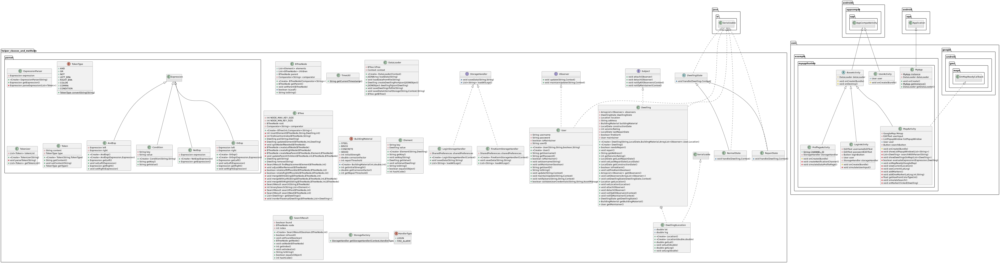

# [G20 - Group 20] Report

[//]: # (The following is a report template to help your team successfully provide all the details necessary for your report in a structured and organised manner. Please give a straightforward and concise report that best demonstrates your project. Note that a good report will give a better impression of your project to the reviewers.)

[//]: # ()
[//]: # (Note that you should have removed ALL TEMPLATE/INSTRUCTION textes in your submission &#40;like the current sentence&#41;, otherwise it hampers the professionality in your documentation.)

[//]: # ()
[//]: # (*Here are some tips to write a good report:*)

[//]: # ()
[//]: # (* `Bullet points` are allowed and strongly encouraged for this report. Try to summarise and list the highlights of your project &#40;rather than give long paragraphs&#41;.*)

[//]: # ()
[//]: # (* *Try to create `diagrams` for parts that could greatly benefit from it.*)

[//]: # ()
[//]: # (* *Try to make your report `well structured`, which is easier for the reviewers to capture the necessary information.*)

[//]: # ()
[//]: # (*We give instructions enclosed in square brackets [...] and examples for each sections to demonstrate what are expected for your project report. Note that they only provide part of the skeleton and your description should be more content-rich. Quick references about markdown by [CommonMark]&#40;https://commonmark.org/help/&#41;*)

## Table of Contents

1. [Team Members and Roles](#team-members-and-roles)
2. [Summary of Individual Contributions](#summary-of-individual-contributions)
3. [Application Description](#application-description)
4. [Application UML](#application-uml)
5. [Application Design and Decisions](#application-design-and-decisions)
6. [Summary of Known Errors and Bugs](#summary-of-known-errors-and-bugs)
7. [Testing Summary](#testing-summary)
8. [Implemented Features](#implemented-features)
9. [Team Meetings](#team-meetings)
10. [Conflict Resolution Protocol](#conflict-resolution-protocol)

## Administrative
- Firebase Repository Link: <insert-link-to-firebase-repository>
   - Confirm: I have already added comp21006442@gmail.com as a Developer to the Firebase project prior to due date.
- Two user accounts for markers' access are usable on the app's APK (do not change the username and password unless there are exceptional circumstances. Note that they are not real e-mail addresses in use):
   - Username: comp2100@anu.edu.au	Password: comp2100  Role: Resident
   - Username: comp6442@anu.edu.au	Password: comp6442  Role: Building manager

## Team Members and Roles
The key area(s) of responsibilities for each member

| UID        |      Name      |          Role |
|:-----------|:--------------:|--------------:|
| [u7776180] |  [Hongyu Li]   | [Team member] |
| [u7757949] | [Juliang Xiao] | [Team member] |
| [u7671098] | [Yujing Zhang] | [Team member] |
| [u7785177] |  [Xinfei Li]   | [Team member] |
| [u7728429] | [Xinrui Zhang] | [Team member] |

## Summary of Individual Contributions

[//]: # (Specific details of individual contribution of each member to the project.)

[//]: # ()
[//]: # (Each team member is responsible for writing **their own subsection**.)

[//]: # ()
[//]: # (A generic summary will not be acceptable and may result in a significant lose of marks.)

[//]: # (*[Summarise the contributions made by each member to the project, e.g. code implementation, code design, UI design, report writing, etc.]*)

[//]: # (*[Code Implementation. Which features did you implement? Which classes or methods was each member involved in? Provide an approximate proportion in pecentage of the contribution of each member to the whole code implementation, e.g. 30%.]*)

[//]: # (*you should ALSO provide links to the specified classes and/or functions*)
[//]: # (Note that the core criteria of contribution is based on `code contribution` &#40;the technical developing of the App&#41;.)

[//]: # (*Here is an example: &#40;Note that you should remove the entire section &#40;e.g. "others"&#41; if it is not applicable&#41;*)

1. **u7776180, Hongyu Li**  I have 20% contribution, as follows:  
  - **Code Contribution in the final App**
    - navigation bar: 
[Navi-bar function](https://gitlab.cecs.anu.edu.au/u7757949/gp-24s1/-/blob/main/MyApplication/app/src/main/java/com/example/myapplication/UserActivity.java#L67-82)
    - Data stream: 
  [login  Activity part](https://gitlab.cecs.anu.edu.au/u7757949/gp-24s1/-/blob/main/MyApplication/app/src/main/java/com/example/myapplication/LoginActivity.java?ref_type=heads#L78-100),
    [Map activity part](https://gitlab.cecs.anu.edu.au/u7757949/gp-24s1/-/blob/main/MyApplication/app/src/main/java/com/example/myapplication/MapActivity.java?ref_type=heads#L417-481),  
    [profile page activity part](https://gitlab.cecs.anu.edu.au/u7757949/gp-24s1/-/blob/main/MyApplication/app/src/main/java/com/example/myapplication/ProfPageActivity.java?ref_type=heads#L215-249)
    - Follow and notification button function:
      [Profilepage Activity](https://gitlab.cecs.anu.edu.au/u7757949/gp-24s1/-/blob/main/MyApplication/app/src/main/java/com/example/myapplication/ProfPageActivity.java?ref_type=heads#L56-196)
    - Marker onclick function: 
      [Map Activity, marker onclick function](https://gitlab.cecs.anu.edu.au/u7757949/gp-24s1/-/blob/main/MyApplication/app/src/main/java/com/example/myapplication/MapActivity.java#L293-327),
    - Tests: 
        -Instrumented tests: 
    [Base activity test](https://gitlab.cecs.anu.edu.au/u7757949/gp-24s1/-/blob/main/MyApplication/app/src/androidTest/java/com/example/myapplication/BaseActivityTest.java#L1-78),[Test activity for base activity test](https://gitlab.cecs.anu.edu.au/u7757949/gp-24s1/-/blob/main/MyApplication/app/src/main/java/com/example/myapplication/TestActivity.java#L1-20), 
      [Login Activity test](https://gitlab.cecs.anu.edu.au/u7757949/gp-24s1/-/blob/main/MyApplication/app/src/androidTest/java/com/example/myapplication/LoginActivityTest.java#L1-163),
    [Login test](https://gitlab.cecs.anu.edu.au/u7757949/gp-24s1/-/blob/main/MyApplication/app/src/androidTest/java/com/example/myapplication/LoginTest.java#L1-157),
    [Profileage activity test](https://gitlab.cecs.anu.edu.au/u7757949/gp-24s1/-/blob/main/MyApplication/app/src/androidTest/java/com/example/myapplication/ProfilePageTest.java#L2-199),
    [Userprofile activity test](https://gitlab.cecs.anu.edu.au/u7757949/gp-24s1/-/blob/main/MyApplication/app/src/androidTest/java/com/example/myapplication/UserProfileTest.java#L1-174), 
    [User notification test](https://gitlab.cecs.anu.edu.au/u7757949/gp-24s1/-/blob/main/MyApplication/app/src/androidTest/java/com/example/myapplication/UsersNotificationTest.java#L1-75)
     -Unit tests: 
    [BTree test](https://gitlab.cecs.anu.edu.au/u7757949/gp-24s1/-/blob/main/MyApplication/app/src/test/java/com/example/myapplication/BTreeTest.java#L1-109),
    [Dataloader test](https://gitlab.cecs.anu.edu.au/u7757949/gp-24s1/-/blob/main/MyApplication/app/src/test/java/com/example/myapplication/DataLoaderTest.java#L1-103), 
    [Dwelling test](https://gitlab.cecs.anu.edu.au/u7757949/gp-24s1/-/blob/main/MyApplication/app/src/test/java/com/example/myapplication/DwellingTest.java#L1-154),
    [FireAlarmStorageHandler test](https://gitlab.cecs.anu.edu.au/u7757949/gp-24s1/-/blob/main/MyApplication/app/src/test/java/com/example/myapplication/FireAlarmStorageHandlerTest.java#L1-84),
    [Loginhandler test](https://gitlab.cecs.anu.edu.au/u7757949/gp-24s1/-/blob/main/MyApplication/app/src/test/java/com/example/myapplication/LoginHandlerTest.java#L1-62),
    [SearchResult test](https://gitlab.cecs.anu.edu.au/u7757949/gp-24s1/-/blob/main/MyApplication/app/src/test/java/com/example/myapplication/SearchResultTest.java#L1-90),
    [StorageFactory test](https://gitlab.cecs.anu.edu.au/u7757949/gp-24s1/-/blob/main/MyApplication/app/src/test/java/com/example/myapplication/StorageFactoryTest.java#L1-52),
    [Other helper methods' test](https://gitlab.cecs.anu.edu.au/u7757949/gp-24s1/-/blob/main/MyApplication/app/src/test/java/com/example/myapplication/UnitTest.java#L1-462),
    [UserActivity element test](https://gitlab.cecs.anu.edu.au/u7757949/gp-24s1/-/blob/main/MyApplication/app/src/test/java/com/example/myapplication/UserActivityTest.java),
    [User test](https://gitlab.cecs.anu.edu.au/u7757949/gp-24s1/-/blob/main/MyApplication/app/src/test/java/com/example/myapplication/UserTest.java)

- **Code and App Design** 
  - Design patterns: 
  Observers design pattern and State design pattern
  - UI Design:  
  Basic interface skeleton. Animation for a button.   

  - **Others**: 
    - Testing Summary writing
    - Google Maps API setup   

2. **U7785177, Xinfei Li**  I have 20% contribution, as follows:  
- **Code Contribution in the final App**
    - Feature Login - [Link to Login Feature](#Basic-Features)
    - Factory Design Pattern - [Link to Factory Pattern](#factory-pattern)
    - Dwelling Material class - [BuildingMaterial.java](https://gitlab.cecs.anu.edu.au/u7757949/gp-24s1/-/blob/main/MyApplication/app/src/main/java/helper_classes_and_methods/BuildingMaterial.java?ref_type=heads)
    - Seismic Rating method - [Class Dwelling Method getSeismicRating](https://gitlab.cecs.anu.edu.au/u7757949/gp-24s1/-/blob/main/MyApplication/app/src/main/java/helper_classes_and_methods/Dwelling.java?ref_type=heads#L155-182)
    - repair and needsRepair method - [Class Dwelling Method needsRepair](https://gitlab.cecs.anu.edu.au/u7757949/gp-24s1/-/blob/main/MyApplication/app/src/main/java/helper_classes_and_methods/Dwelling.java?ref_type=heads#L89-122) and [Class Dwelling Method repair](https://gitlab.cecs.anu.edu.au/u7757949/gp-24s1/-/blob/main/MyApplication/app/src/main/java/helper_classes_and_methods/Dwelling.java?ref_type=heads#L123-148)

3. **u7671098, Yujing Zhang**  I have 20% contribution, as follows:  
- **Code Contribution in the final App**
    - GPS function - class MapActivity: [viewCurrentLocation()](https://gitlab.cecs.anu.edu.au/u7757949/gp-24s1/-/blob/main/MyApplication/app/src/main/java/com/example/myapplication/MapActivity.java?ref_type=heads#L329-366)
    - show Data(the way to mark on the map) -  class MapActivity: [addMarkers()，addOneMarker(),getHueFromColorType()](https://gitlab.cecs.anu.edu.au/u7757949/gp-24s1/-/blob/main/MyApplication/app/src/main/java/com/example/myapplication/MapActivity.java?ref_type=heads#L374-413)
    - profile page and user page(layout and data display):[activity_prof_page.xml](https://gitlab.cecs.anu.edu.au/u7757949/gp-24s1/-/blob/main/MyApplication/app/src/main/res/layout-land/activity_prof_page.xml?ref_type=heads), [activity_user.xml](https://gitlab.cecs.anu.edu.au/u7757949/gp-24s1/-/blob/main/MyApplication/app/src/main/res/layout-land/activity_user.xml?ref_type=heads)
    - UI Landscape: [activity_login.xml(land)](https://gitlab.cecs.anu.edu.au/u7757949/gp-24s1/-/blob/main/MyApplication/app/src/main/res/layout-land/activity_login.xml?ref_type=heads), [activity_main.xml(land)](https://gitlab.cecs.anu.edu.au/u7757949/gp-24s1/-/blob/main/MyApplication/app/src/main/res/layout-land/activity_main.xml?ref_type=heads), [activity_prof_page(land)](https://gitlab.cecs.anu.edu.au/u7757949/gp-24s1/-/blob/main/MyApplication/app/src/main/res/layout-land/activity_prof_page.xml?ref_type=heads),[activity_user(land)](https://gitlab.cecs.anu.edu.au/u7757949/gp-24s1/-/blob/main/MyApplication/app/src/main/res/layout-land/activity_user.xml?ref_type=heads)

- **Code and App Design**
    - UI Design: Adjusting pages layout, Theme color,images design and display logo, [Launch logo](https://gitlab.cecs.anu.edu.au/u7757949/gp-24s1/-/blob/main/MyApplication/app/src/main/res/drawable/app_logo.png?ref_type=heads),tools:Sketch,Photoshop]*   

- **Others**:
    - Report: Application Details 
            
4. **u7728429, Xinrui Zhang**  I have 22% contribution, as follows:  
- **Code Contribution in the final App**
    - Load data from local file and save data to json file - class DataLoader: [DataLoader.java](https://gitlab.cecs.anu.edu.au/u7757949/gp-24s1/-/blob/main/MyApplication/app/src/main/java/helper_classes_and_methods/DataLoader.java?ref_type=heads)
    - parser - class ExpressionParser: [ExpressionParser.java](https://gitlab.cecs.anu.edu.au/u7757949/gp-24s1/-/blob/main/MyApplication/app/src/main/java/helper_classes_and_methods/parser/ExpressionParser.java?ref_type=heads)
    - tokenizer - class Tokenizer: [Tokenizer.java](https://gitlab.cecs.anu.edu.au/u7757949/gp-24s1/-/blob/main/MyApplication/app/src/main/java/helper_classes_and_methods/parser/Tokenizer.java?ref_type=heads)
    - fuzzy search - class MapActivity: [showListPopupWindow()](https://gitlab.cecs.anu.edu.au/u7757949/gp-24s1/-/blob/main/MyApplication/app/src/main/java/com/example/myapplication/MapActivity.java?ref_type=heads#L165-189)
    
- **Code and App Design**
    - data structures: part of B-tree searching function [B-tree search](https://gitlab.cecs.anu.edu.au/u7757949/gp-24s1/-/blob/main/MyApplication/app/src/main/java/helper_classes_and_methods/BTree.java?ref_type=heads#L380-406),tools:Android studio]*   

- **Others**: 
    - Parser part writing

5. **u7757949, Juliang Xiao**  I have 18% contribution, as follows:  
- **Code Contribution in the final App**
- data structures: almost all the data structure of B-tree-class BTree:[BTree.java](https://gitlab.cecs.anu.edu.au/u7757949/gp-24s1/-/blob/main/MyApplication/app/src/main/java/helper_classes_and_methods/BTree.java?ref_type=heads)
- other part of data structure-class Btree node,Element,SearchResult:[BtreeNode.java](https://gitlab.cecs.anu.edu.au/u7757949/gp-24s1/-/blob/main/MyApplication/app/src/main/java/helper_classes_and_methods/BTreeNode.java?ref_type=heads)[Element.java](https://gitlab.cecs.anu.edu.au/u7757949/gp-24s1/-/blob/main/MyApplication/app/src/main/java/helper_classes_and_methods/Element.java?ref_type=heads)[SearchResult.java](https://gitlab.cecs.anu.edu.au/u7757949/gp-24s1/-/blob/main/MyApplication/app/src/main/java/helper_classes_and_methods/SearchResult.java?ref_type=heads)
  - Parser search:class MapActivity:[onClick(),afterTextChanged(),searchWithParser(),showDwellingsOnMap(),evaluateExpressio()](https://gitlab.cecs.anu.edu.au/u7757949/gp-24s1/-/blob/main/MyApplication/app/src/main/java/com/example/myapplication/MapActivity.java?ref_type=heads#L94-160)(https://gitlab.cecs.anu.edu.au/u7757949/gp-24s1/-/blob/main/MyApplication/app/src/main/java/com/example/myapplication/MapActivity.java?ref_type=heads#L196-290)

- **Others**: 
  - draw UML diagrams
  - video record
## Application Description

[//]: # (*[What is your application, what does it do? Include photos or diagrams if necessary]*)

[//]: # (*Here is a pet specific application example*)

*The inspiration for My Dwelling comes from the idea that 'Sustainable development is about the way urban spaces are built and managed.
' The objective is to offer a safe dwelling map for an area or city, which will display the seismic level 0-10 (red to green) of each building on the map. 
This will be beneficial for areas likely to be impacted by earthquakes, supporting local governments in making decisions about city planning.
Local residents will also benefit from this app because it provides fire alarm notifications for dwellings, which improves community safety. 
For community managers, the app provides automatic notifications for repairs based on multiple parameter calculations and the function to report the fire alarm as well. *

### Application Use Cases and or Examples

[//]: # (*[Provide use cases and examples of people using your application. Who are the target users of your application? How do the users use your application?]*)

[//]: # (*Here is a pet training application example*)

*Jane is an officer, and is responsible for building and community safety in an area.*
1. *She needs to know the dwelling seismic and report to local government...*
2. *She needs to know if the building needs repairs and to connect with a house repair company.*
3. *she needs to alarm the residents when emergent*

*Here is a map navigation application example*

*Target User: Residents*

* *Users can view the current street, follow the buildings they care about.*
* *receive fire alarm notifications*
* *and view the login and notifications log*

*Target user: Building Managers*

* *Can view if the building need repairs, the app provides automatic notifications for repairs based on multiple parameter calculations*
* *Sent fire alarm to the subscriber*...

*Target user: Local Government*
* *view the building on the map.*
* *view the visual seismic ‘color’ of each building, allowing officials to monitor specific buildings or areas. These data help officials in urban planning and emergency management decisions, such as determining which buildings need reinforcement or reconstruction.*

[//]: # (*List all the use cases in text descriptions or create use case diagrams. Please refer to https://www.visual-paradigm.com/guide/uml-unified-modeling-language/what-is-use-case-diagram/ for use case diagram.*)

 

### Application UML

  
*[Replace the above with a class diagram. You can look at how we have linked an image here as an example of how you can do it too.]*

## Code Design and Decisions

[//]: # (This is an important section of your report and should include all technical decisions made. Well-written justifications will increase your marks for both the report as well as for the relevant parts &#40;e.g., data structure&#41;. This includes, for example,)

- Details about the parser :

    We use tokenizers and parsers in searching function. The parser and tokenizer first split an input string into tokens and return a list of tokens containing all the tokens, and then parse the tokens to generate an expression object, where the input string follows the and(x:xxx,or(x:xxx,not(x:xxx))) format.

    The parser and tokenizer first split an input string into tokens and return a list of tokens containing all the tokens, and then parse the tokens to generate an expression object, where the input string follows the and(x:xxx,or(x:xxx,not(x:xxx))) format

- Decisions made 

    In our dataset, most of the addresses we used are from the addresses of restaurants in Canberra, since usually the address of each restaurant is unique and won’t be repeated.

    The data structure we used is B-Tree, the best feature of B-Tree is that its searching is quicker when there’s a huge dataset, because each node can save multiple key-value pairs.

[//]: # (- Details about the design patterns used &#40;where in the code, justification of the choice, etc&#41;)

[//]: # (*Please give clear and concise descriptions for each subsections of this part. It would be better to list all the concrete items for each subsection and give no more than `5` concise, crucial reasons of your design.)

- Details about the design patterns 

    Observer Pattern: To ensure the users can get notification from their followed building, we implement this observer pattern.
    State Pattern: Two states: normal state and (need) repair state are created to define the repair button's visibility and need notification from service providers.
    Factory method: To track and display user activity, we can leverage the Factory Method Pattern. This pattern simplifies the process of duplicating and extending our function both now and in the future. By using the Factory Method, we can create a flexible and scalable solution for managing user activities.

### Data Structures

[//]: # (*[What data structures did your team utilise? Where and why?]*)

[//]: # (Here is a partial &#40;short&#41; example for the subsection `Data Structures`:*)

*I used the following data structures in my project:*

1. *BTree*
   * *Objective:Used for storing dwellings and performing efficient searches based on their key values.*
   * *Code Locations: defined in [BTree.java](https://gitlab.cecs.anu.edu.au/u7757949/gp-24s1/-/blob/main/MyApplication/app/src/main/java/helper_classes_and_methods/BTree.java?ref_type=heads#L1-406) and Supported by the [BTreeNode.java](https://gitlab.cecs.anu.edu.au/u7757949/gp-24s1/-/blob/main/MyApplication/app/src/main/java/helper_classes_and_methods/BTreeNode.java?ref_type=heads#L1-53) and store key-value pairs by the [Element.java](https://gitlab.cecs.anu.edu.au/u7757949/gp-24s1/-/blob/main/MyApplication/app/src/main/java/helper_classes_and_methods/Element.java?ref_type=heads#L1-82) and search results in [SearchResult.java](https://gitlab.cecs.anu.edu.au/u7757949/gp-24s1/-/blob/main/MyApplication/app/src/main/java/helper_classes_and_methods/SearchResult.java?ref_type=heads#L1-65) and pocessed in [dwellingToJson()](https://gitlab.cecs.anu.edu.au/u7757949/gp-24s1/-/blob/main/MyApplication/app/src/main/java/helper_classes_and_methods/DataLoader.java?ref_type=heads#L106-133) and [getBTree](https://gitlab.cecs.anu.edu.au/u7757949/gp-24s1/-/blob/main/MyApplication/app/src/main/java/helper_classes_and_methods/DataLoader.java?ref_type=heads#L174-179) .*
   * *Reasons:*
      * *BTree provides efficient search, insertion, and deletion operations with logarithmic time complexity, suitable for large datasets.*
      * *The balanced structure of the BTree ensures consistent performance for all operations.*
      * *BTrees are particularly useful when data cannot fit entirely into memory as they minimize disk I/O operations.*

2. *ArrayList*
    * *Objective: Used to store elements within BTree nodes and maintain lists of child nodes.*
    * *Code Locations:defined in[BTreeNode.java](https://gitlab.cecs.anu.edu.au/u7757949/gp-24s1/-/blob/main/MyApplication/app/src/main/java/helper_classes_and_methods/BTreeNode.java?ref_type=heads#L1-53) and processed using [BTree.java](https://gitlab.cecs.anu.edu.au/u7757949/gp-24s1/-/blob/main/MyApplication/app/src/main/java/helper_classes_and_methods/BTree.java?ref_type=heads#L84-367) *
    * *Reasons:*
       * * ArrayList provides dynamic resizing and efficient random access to elements.*
       * * The relatively small size of elements and child nodes within a BTree node makes ArrayList a suitable choice.*

3. *List (ArrayList)*
    * *Objective:Used to store and manipulate lists of Dwelling objects.*
    * *Code Locations: defined in [searchWithParser][searchWithParser] (https://gitlab.cecs.anu.edu.au/u7757949/gp-24s1/-/blob/main/MyApplication/app/src/main/java/com/example/myapplication/MapActivity.java?ref_type=heads#L196-248).*
    * *Reasons:*
       * *List provides an ordered, repeatable collection suitable for storing and manipulating Dwelling objects.*
       * *ArrayList, as an implementation of the List interface, provides dynamic array capabilities, enabling efficient addition, removal, and traversal of elements.*
       * *In this scenario, manipulating and filtering a list of dwellings makes the use of List (ArrayList) appropriate.*

### Design Patterns

[//]: # (*[What design patterns did your team utilise? Where and why?]*)

1. *Observer Pattern*
   * *Objective: used for storing the followers for the follow and notification feature.*
   * *Code Locations: defined in [Class observer](https://gitlab.cecs.anu.edu.au/u7757949/gp-24s1/-/blob/main/MyApplication/app/src/main/java/helper_classes_and_methods/Observer.java#L1-23) and [Notify users](https://gitlab.cecs.anu.edu.au/u7757949/gp-24s1/-/blob/main/MyApplication/app/src/main/java/helper_classes_and_methods/Subject.java#L1-16); processed using [dataStructureHandlerMethod](https://gitlab.cecs.anu.edu.au/u7757949/gp-24s1/-/blob/main/MyApplication/app/src/main/java/helper_classes_and_methods/User.java#L83-145) and [dwelling's update](https://gitlab.cecs.anu.edu.au/u7757949/gp-24s1/-/blob/main/MyApplication/app/src/main/java/helper_classes_and_methods/Dwelling.java#L228-265)
   * *Reasons:*
      * Each building have two aspects for users: followed and unfollowed;
      * The change of a user's follow/unfollow will affect the building's followers list;
      * Notify the followers the information of dwellings' fire alarm situation and these followers are not tightly coupled.
2. *Factory Pattern*
    * *Objective: used for storing and loading login and fire alarm history for LoadShowData feature.*
    * Code Locations: Interface: [Interface StorageHandler](https://gitlab.cecs.anu.edu.au/u7757949/gp-24s1/-/blob/main/MyApplication/app/src/main/java/helper_classes_and_methods/StorageHandler.java) 
    * Helper class: [TimeUtil.java](https://gitlab.cecs.anu.edu.au/u7757949/gp-24s1/-/blob/main/MyApplication/app/src/main/java/helper_classes_and_methods/TimeUtil.java); 
    * 2 Handler: [FireAlarmStorageHandler.java](https://gitlab.cecs.anu.edu.au/u7757949/gp-24s1/-/blob/main/MyApplication/app/src/main/java/helper_classes_and_methods/FireAlarmStorageHandler.java);
    * and [LoginStorageHandler.java](https://gitlab.cecs.anu.edu.au/u7757949/gp-24s1/-/blob/main/MyApplication/app/src/main/java/helper_classes_and_methods/LoginStorageHandler.java);
    * Factory: [StorageFactory.java](https://gitlab.cecs.anu.edu.au/u7757949/gp-24s1/-/blob/main/MyApplication/app/src/main/java/helper_classes_and_methods/StorageFactory.java);
    * Record logs in [ProfPageActivity.java line 29, 47 and 149](https://gitlab.cecs.anu.edu.au/u7757949/gp-24s1/-/blob/main/MyApplication/app/src/main/java/com/example/myapplication/ProfPageActivity.java) 
    * and [LoginActivity.java.java line 35, 51 and 64](https://gitlab.cecs.anu.edu.au/u7757949/gp-24s1/-/blob/main/MyApplication/app/src/main/java/com/example/myapplication/LoginActivity.java)
    * Present the history in [UserActivity.java line 48-65](https://gitlab.cecs.anu.edu.au/u7757949/gp-24s1/-/blob/main/MyApplication/app/src/main/java/com/example/myapplication/UserActivity.java?ref_type=heads#L48-65)
    * *Reasons:*
        * Scalable Logging: Easily add more local logs as needed.
        * Local Storage: Keeps login and fire alarm history on-device for better activity tracking.
        * Persistent Logs: Maintains logs across restarts, ensuring data isn't lost, enhancing system reliability and historical data accessibility.
3.  *State Pattern*
    * *Objective: used for storing Normal state and (Need) Repair state for Dwelling.State feature.*
    * *Code Locations: defined in [abstract Dwelling state class](https://gitlab.cecs.anu.edu.au/u7757949/gp-24s1/-/blob/main/MyApplication/app/src/main/java/helper_classes_and_methods/DwellingState.java#L1-19) and [class Normal state](https://gitlab.cecs.anu.edu.au/u7757949/gp-24s1/-/blob/main/MyApplication/app/src/main/java/helper_classes_and_methods/NormalState.java#L1-20) and [class Repair state](https://gitlab.cecs.anu.edu.au/u7757949/gp-24s1/-/blob/main/MyApplication/app/src/main/java/helper_classes_and_methods/RepairState.java#L1-17); processed using [notifymaintainer method](https://gitlab.cecs.anu.edu.au/u7757949/gp-24s1/-/blob/main/MyApplication/app/src/main/java/helper_classes_and_methods/Dwelling.java#L257-265) 
    * *Reasons:* 
        * The building's states are identifiable need repair state and normal state;
        *  Each state defined the repair button's visibility and need notification from service providers.
 
          

### Parser

### <u>Grammar(s)</u>
*We modeled the design after the parser method on lection.The and and or statements require two key-value pairs separated by commas, while the not statement has only one key-value pair.*

Production Rules:

    and(key:value,key:value)
    or(key:value,key:value)
    not(key:value)
    for example: and(fireAlarm:"false",not(buildingMaterial:"wood"))

### <u>Tokenizers and Parsers</u>

[//]: # (*[Where do you use tokenisers and parsers? How are they built? What are the advantages of the designs?]*)

We use tokenizers and parsers in searching function. The parser and tokenizer first split an input string into tokens and return a list of tokens containing all the tokens, and then parse the tokens to generate an expression object, where the input string follows the and(x:xxx,or(x:xxx,not(x:xxx))) format. It can be very useful when searching particular dwellings.

[//]: # (### Others)

[//]: # ()
[//]: # (*[What other design decisions have you made which you feel are relevant? Feel free to separate these into their own subheadings.]*)

[//]: # ()
[//]: # ( )

[//]: # (
)

## Implemented Features

[//]: # (*[What features have you implemented? where, how, and why?]*  )

[//]: # (*List all features you have completed in their separate categories with their featureId. THe features must be one of the basic/custom features, or an approved feature from Voice Four Feature.*)

### Basic Features
1. [LogIn]. Users must be able to log in (not necessarily sign up). (easy)
   * Code: [Class User, method validateUserCredentials](https://gitlab.cecs.anu.edu.au/u7757949/gp-24s1/-/blob/main/MyApplication/app/src/main/java/helper_classes_and_methods/User.java?ref_type=heads#L142-189) and [Class UserActivity](https://gitlab.cecs.anu.edu.au/u7757949/gp-24s1/-/blob/main/MyApplication/app/src/main/java/com/example/myapplication/UserActivity.java?ref_type=heads)
   * Feature: User can log in different username and password, mismatched username and password will not allow to login   
   * Implementation:  User input username and password in Class UserActivity. Then use Class User, method validateUserCredentials to validate the user information. After successful login, turn to MapActivity page. 

2. [DataFiles]. Create a dataset with at least 2,500 valid data instances, each representing a meaningful
   piece of information in your app. The data should be represented and stored in a structured format
   taught in the course. (easy)
   * Code to the Data File [dataset.json](https://gitlab.cecs.anu.edu.au/u7757949/gp-24s1/-/blob/main/MyApplication/app/src/main/assets/dataset.json?ref_type=heads)

3. [LoadShowData] Load and display data instances from your dataset. Choose an appropriate format
   to present the different types of data. (easy)
   * Code: [Class DataLoader](https://gitlab.cecs.anu.edu.au/u7757949/gp-24s1/-/blob/main/MyApplication/app/src/main/java/helper_classes_and_methods/DataLoader.java?ref_type=heads)
   * Feature: data will be stored in B-tree structure from json file.  
   * Implementation: Load data from local file and save data to json file. 

4. [DataStream] 
    * Code: [Datastream method called in login activity](https://gitlab.cecs.anu.edu.au/u7757949/gp-24s1/-/blob/main/MyApplication/app/src/main/java/com/example/myapplication/LoginActivity.java?ref_type=heads#L47-48),[Datastream method called in mapactivity](https://gitlab.cecs.anu.edu.au/u7757949/gp-24s1/-/blob/main/MyApplication/app/src/main/java/com/example/myapplication/MapActivity.java?ref_type=heads#L71-72), [Datastream method called in profile page activity](https://gitlab.cecs.anu.edu.au/u7757949/gp-24s1/-/blob/main/MyApplication/app/src/main/java/com/example/myapplication/ProfPageActivity.java?ref_type=heads#L51-52)
    [Simulate datastream method in login activity](https://gitlab.cecs.anu.edu.au/u7757949/gp-24s1/-/blob/main/MyApplication/app/src/main/java/com/example/myapplication/LoginActivity.java?ref_type=heads#L78-101), [Simulate datastream method in map activity](https://gitlab.cecs.anu.edu.au/u7757949/gp-24s1/-/blob/main/MyApplication/app/src/main/java/com/example/myapplication/MapActivity.java?ref_type=heads#L417-482),[Simulate Datastream in profile page acitvity](https://gitlab.cecs.anu.edu.au/u7757949/gp-24s1/-/blob/main/MyApplication/app/src/main/java/com/example/myapplication/ProfPageActivity.java?ref_type=heads#L216-250)
    * Feature:  Simulate user's action
    * Implementation: At first, I tried to use espresso to create a simulating datastream, but I found out these kind of tools can't simulate the operation in Google Maps API. Thus, three individual simulating datastreams are created in three activities, when all these simulating datastream methods are called, datastream would start working completely, which simply simulates a user's operation. 

5.  [Search] Users must be able to search for information on your app. (medium)
    Given the user's input based on pre-defined grammar(s), a query processor "understands" and
    retrieves the information that meets the user's query. The usag is dependent on your app theme.  
    a. must make use of a tokeniser and parser with a formal grammar of your own creation.
    * Code: [class MapActivity, method searchWithParser](https://gitlab.cecs.anu.edu.au/u7757949/gp-24s1/-/blob/main/MyApplication/app/src/main/java/com/example/myapplication/MapActivity.java?ref_type=heads#L196-217),[class MapActivity, method showDwellingsOnMap](https://gitlab.cecs.anu.edu.au/u7757949/gp-24s1/-/blob/main/MyApplication/app/src/main/java/com/example/myapplication/MapActivity.java?ref_type=heads#L223-248),[class MapActivity, method evaluateExpression](https://gitlab.cecs.anu.edu.au/u7757949/gp-24s1/-/blob/main/MyApplication/app/src/main/java/com/example/myapplication/MapActivity.java?ref_type=heads#L256-290)
    * Feature: Search in the type of parser and tokeniser
    * Implementation: The tokenizer-based search functionality allows users to input complex search queries and filters dwellings based on multiple criteria such as address, construction date, fire alarm status, building material, dwelling state, and last repair date. The parser supports advanced search expressions using tokens like AND, OR, and NOT.
      

### Custom Features
Feature Category:Search-related features  
1. [Search-Invalid] On top of giving search results from valid inputs, search functionality can process
   and correctly handle partially invalid search queries and give meaningful results. (medium)
    * Code: [class MapActivity, method searchWithParser,method evaluateExpression.](https://gitlab.cecs.anu.edu.au/u7757949/gp-24s1/-/blob/main/MyApplication/app/src/main/java/com/example/myapplication/MapActivity.java?ref_type=heads#L114-291)
    * Implementation:  Uses an ExpressionParser to parse the input string into an Expression object, evaluates this expression against each dwelling, and collects the matching dwellings into a list.  
        

   

Feature Category:UI Design and Testing   
2. [UI-Layout] Incorporate suitable layout adjustments in the UI components for portrait and landscape
   layout variants, as well as different screen sizes. (easy)
   a. No marks awarded by only using Android studio's automated support for orientation and
   screen sizes without proper adjustments.
    * Code:[(land)activity_login.xml](https://gitlab.cecs.anu.edu.au/u7757949/gp-24s1/-/blob/main/MyApplication/app/src/main/res/layout-land/activity_login.xml?ref_type=heads)
    * Implementation: Remove the vertical elements like logos to fit the land view.
    * Code:[(land)activity_main.xml](https://gitlab.cecs.anu.edu.au/u7757949/gp-24s1/-/blob/main/MyApplication/app/src/main/res/layout-land/activity_main.xml?ref_type=heads)
    * Implementation:Change the width of search bar and menu to fit the land page.
    * Code:[(land)activity_prof_page.xml](https://gitlab.cecs.anu.edu.au/u7757949/gp-24s1/-/blob/main/MyApplication/app/src/main/res/layout-land/activity_prof_page.xml?ref_type=heads)
    * Implementation: Remove the image to fit the display, and change the layout of the buttons. 
    * Code:[(land)activity_user.xml](https://gitlab.cecs.anu.edu.au/u7757949/gp-24s1/-/blob/main/MyApplication/app/src/main/res/layout-land/activity_user.xml?ref_type=heads)
    * Implementation: Remove the greetings and chaneg the width of search bar and menu to fit the land page. 
      
        

3. [UI-Test]. Partially finished, since the operation of the Google Maps API in the middle section cannot be simulated by espresso.
    * Code:[LoginActivity test](https://gitlab.cecs.anu.edu.au/u7757949/gp-24s1/-/blob/main/MyApplication/app/src/androidTest/java/com/example/myapplication/LoginActivityTest.java#L1-163)
    * Implementation: Tested the app can correctly jump to the mapactivity after logging in with the provided account and password.  
    * Code:[Login test](https://gitlab.cecs.anu.edu.au/u7757949/gp-24s1/-/blob/main/MyApplication/app/src/androidTest/java/com/example/myapplication/LoginTest.java#L90-154)
    * Implementation: Tested authorization in login activity. 
    * Code:[Profilepage activity test](https://gitlab.cecs.anu.edu.au/u7757949/gp-24s1/-/blob/main/MyApplication/app/src/androidTest/java/com/example/myapplication/ProfilePageTest.java#L1-199)
    * Implementation: Tested that the profile page correctly displays information corresponding to the provided dwelling instance, and that the corresponding elements are unavailable when the user does not have sufficient permissions.  
    * Code:[User profile activity test](https://gitlab.cecs.anu.edu.au/u7757949/gp-24s1/-/blob/main/MyApplication/app/src/androidTest/java/com/example/myapplication/UserProfileTest.java#L1-175)
    * Implementation: Tested that after the user logs in, the correct personal information can be seen in the user profile page.
     

Feature Category:Greater Data Usage, Handling and Sophistication  
4.[Data-Formats]. Read data from local files in at least 2 different formats (JSON, XML, etc.). (easy)
* Code: [Class User, method validateUserCredentials](https://gitlab.cecs.anu.edu.au/u7757949/gp-24s1/-/blob/main/MyApplication/app/src/main/java/helper_classes_and_methods/User.java?ref_type=heads#L142-189)
* Implementation: Read local csv file.  
* Code: [Class LoginStorageHandler, method loadAllLogs](https://gitlab.cecs.anu.edu.au/u7757949/gp-24s1/-/blob/main/MyApplication/app/src/main/java/helper_classes_and_methods/LoginStorageHandler.java?ref_type=heads#L35-52) and [Class FireAlarmStorageHandler, methods loadAllLogs()](https://gitlab.cecs.anu.edu.au/u7757949/gp-24s1/-/blob/main/MyApplication/app/src/main/java/helper_classes_and_methods/FireAlarmStorageHandler.java?ref_type=heads#L35-52)
* Implementation: Using SharedPreferences of Android to store and read the xml file on the mobile device.  
* Code: [Class DataLoader](https://gitlab.cecs.anu.edu.au/u7757949/gp-24s1/-/blob/main/MyApplication/app/src/main/java/helper_classes_and_methods/DataLoader.java?ref_type=heads)
* Implementation: Read json file.  
  
   
Feature Category:Greater Data Usage, Handling and Sophistication  
5. [Data-Profile] Create a Profile Page for Users or any Entities, which contains a media file (image,
   animation (e.g., gif), video). (easy)
    * Code:[ProfPageActivity.java](https://gitlab.cecs.anu.edu.au/u7757949/gp-24s1/-/blob/main/MyApplication/app/src/main/java/com/example/myapplication/ProfPageActivity.java?ref_type=heads)
    * Implementation: A Profile Page for dwellings details, shows images according to different material type as well.
    * Code:[activity_prof_page.xml](https://gitlab.cecs.anu.edu.au/u7757949/gp-24s1/-/blob/main/MyApplication/app/src/main/res/layout/activity_prof_page.xml?ref_type=heads)
    * Implementation:Layout of profile page.  
 
   

6. [Data-GPS] Use GPS information based on location data in your App. (easy)  
    * Code: class MapActivity: [viewCurrentLocation()](https://gitlab.cecs.anu.edu.au/u7757949/gp-24s1/-/blob/main/MyApplication/app/src/main/java/com/example/myapplication/MapActivity.java?ref_type=heads#L329-366)
    * Implementation: Require for user's current location.Use LocationManager.  
       
        

7. [Interact-Follow] The ability to ‘follow’ items. There must be a section that presents all the items
   followed by a user, grouped, and ordered. [stored in-memory] (medium)
    * Code:[follow function](https://gitlab.cecs.anu.edu.au/u7757949/gp-24s1/-/blob/main/MyApplication/app/src/main/java/com/example/myapplication/ProfPageActivity.java?ref_type=heads#L102-136)
    * Implementation: follow button's function, check if the user already in the list, if not, attach the user to <observers> list when click follow button, then change button text to be "unfollow" and set the background color grey. When click again detach the users and change the text and background color back and Vice versa.
    * Code:[followers list](https://gitlab.cecs.anu.edu.au/u7757949/gp-24s1/-/blob/main/MyApplication/app/src/main/java/helper_classes_and_methods/Dwelling.java?ref_type=heads#L45-46)
    * Implementation: Record the followers
        
8. [Interact-Noti] The ability to send notifications for interactions (e.g., follow request, product viewed,
   etc.). A notification must be sent only after a predetermined number of interactions are set [e.g.,
   when ≥2 requests have been received or 2 follow requests have been received). (medium)
    * Code:[firealarm button onclick function](https://gitlab.cecs.anu.edu.au/u7757949/gp-24s1/-/blob/main/MyApplication/app/src/main/java/com/example/myapplication/ProfPageActivity.java?ref_type=heads#L144-154)
    * Implementation: Clicking this button will trigger notify method and create a channel
    * Code: [notify methods](https://gitlab.cecs.anu.edu.au/u7757949/gp-24s1/-/blob/main/MyApplication/app/src/main/java/helper_classes_and_methods/User.java?ref_type=heads#L83-145)
    * Implementation: notify users with a popup notification
    * Code:[create channel](https://gitlab.cecs.anu.edu.au/u7757949/gp-24s1/-/blob/main/MyApplication/app/src/main/java/com/example/myapplication/ProfPageActivity.java?ref_type=heads#L202-214)
    * Implementation: Create a notification channel
        

[//]: # (### Surprise Features)

[//]: # ()
[//]: # (- Suprised feature is not implemented.)

[//]: # ()
[//]: # (  
)

## Summary of Known Errors and Bugs

[//]: # (*[Where are the known errors and bugs? What consequences might they lead to?]*)

[//]: # (*List all the known errors and bugs here. If we find bugs/errors that your team does not know of, it shows that your testing is not thorough.*)

[//]: # ()
[//]: # (*Here is an example:*)

1. *Bug 1:*
   - *A space bar (' ') in the sign in email will crash the application.*
   - ...

2. *Bug 2:*
    - *Jacoco cannot correctly generate reports with coverage for instrumented tests *
    - There are several tests that run fine when run individually, but they would fail when run all tests. The error message shows that animation is not disabled, but after disabling animation, the error message is still the same as the original result.

  

## Testing Summary

[//]: # (*[What features have you tested? What is your testing coverage?]*)
[//]: # (*Please provide some screenshots of your testing summary, showing the achieved testing coverage. Feel free to provide further details on your tests.*)

1. Tests for BTree
- code: [BTree test](https://gitlab.cecs.anu.edu.au/u7757949/gp-24s1/-/blob/main/MyApplication/app/src/test/java/com/example/myapplication/BTreeTest.java?ref_type=heads#L1-113)
  for the [BTree class](https://gitlab.cecs.anu.edu.au/u7757949/gp-24s1/-/blob/main/MyApplication/app/src/main/java/helper_classes_and_methods/BTree.java?ref_type=heads#L1-406)
- *Number of test cases: 7*
- *Types of tests created and descriptions:  Tested the methods in Btree class are correct*

2. Tests for DataLoader
- code: [DataLoader test](https://gitlab.cecs.anu.edu.au/u7757949/gp-24s1/-/blob/main/MyApplication/app/src/test/java/com/example/myapplication/DataLoaderTest.java?ref_type=heads#L1-103)
  for the [Dataloader class](https://gitlab.cecs.anu.edu.au/u7757949/gp-24s1/-/blob/main/MyApplication/app/src/main/java/helper_classes_and_methods/DataLoader.java?ref_type=heads#L1-178)
- *Number of test cases: 4*
- *Types of tests created and descriptions:  Unit test, tested the methods getBtree, saveDataInternalStorage createDwellingFromJson are correct.*
3. Tests for Dwelling
- code: [Dwelling test](https://gitlab.cecs.anu.edu.au/u7757949/gp-24s1/-/blob/main/MyApplication/app/src/test/java/com/example/myapplication/DwellingTest.java?ref_type=heads#L1-154)
  for the [ Dwelling class ](https://gitlab.cecs.anu.edu.au/u7757949/gp-24s1/-/blob/main/MyApplication/app/src/main/java/helper_classes_and_methods/Dwelling.java?ref_type=heads#L1-279)
- *Number of test cases: 18*
- *Types of tests created and descriptions:   Unit test, tested all the methods in Dwelling class*
4. Tests for FireAlarmStorageHandler
- code: [FireAlarmStorageHandler test](https://gitlab.cecs.anu.edu.au/u7757949/gp-24s1/-/blob/main/MyApplication/app/src/test/java/com/example/myapplication/FireAlarmStorageHandlerTest.java?ref_type=heads#L1-84)
  for the [FireAlarmStorageHandler class](https://gitlab.cecs.anu.edu.au/u7757949/gp-24s1/-/blob/main/MyApplication/app/src/main/java/helper_classes_and_methods/FireAlarmStorageHandler.java?ref_type=heads#L1-54)
- *Number of test cases: 2*
- *Types of tests created and descriptions:   Unit test, ensured the functions saveData and loadAllLogs complete*
5. Tests for LoginHandler
- code: [LoginHandler test](https://gitlab.cecs.anu.edu.au/u7757949/gp-24s1/-/blob/main/MyApplication/app/src/test/java/com/example/myapplication/LoginHandlerTest.java?ref_type=heads#L1-62)
  for the [LoginHandler class](https://gitlab.cecs.anu.edu.au/u7757949/gp-24s1/-/blob/main/MyApplication/app/src/main/java/helper_classes_and_methods/LoginStorageHandler.java?ref_type=heads#L1-54)
- *Number of test cases: 1*
- *Types of tests created and descriptions:    Unit test, ensured the function loadAllLogs complete*
6. Tests for SearchResult
- code: [SearchResult test](https://gitlab.cecs.anu.edu.au/u7757949/gp-24s1/-/blob/main/MyApplication/app/src/test/java/com/example/myapplication/SearchResultTest.java?ref_type=heads#L1-90)
  for the [SearchResult class](https://gitlab.cecs.anu.edu.au/u7757949/gp-24s1/-/blob/main/MyApplication/app/src/main/java/helper_classes_and_methods/SearchResult.java?ref_type=heads#L1-65)
- *Number of test cases: 11*
- *Types of tests created and descriptions:  Unit test, tested the getter methods and the override methods are correct*
7. Tests for StorageFactory
- code: [StorageFactory test](https://gitlab.cecs.anu.edu.au/u7757949/gp-24s1/-/blob/main/MyApplication/app/src/test/java/com/example/myapplication/StorageFactoryTest.java?ref_type=heads#L1-52)
  for the [StorageFactory class](https://gitlab.cecs.anu.edu.au/u7757949/gp-24s1/-/blob/main/MyApplication/app/src/main/java/helper_classes_and_methods/StorageFactory.java?ref_type=heads#L1-28)
- *Number of test cases: 4*
- *Types of tests created and descriptions:   Unit test, ensured the getter method can get the proper type of handlers*
8. Tests for UserActivity
- code: [User Activity logs test](https://gitlab.cecs.anu.edu.au/u7757949/gp-24s1/-/blob/main/MyApplication/app/src/test/java/com/example/myapplication/UserActivityTest.java?ref_type=heads#L1-72)
  for the [Load logs function in UserActivity](https://gitlab.cecs.anu.edu.au/u7757949/gp-24s1/-/blob/main/MyApplication/app/src/main/java/com/example/myapplication/UserActivity.java?ref_type=heads#L47-60)
- *Number of test cases: 1*
- *Types of tests created and descriptions:   Unit test, ensured the user activity record the logs correctly*
9. Tests for User
- code: [User test](https://gitlab.cecs.anu.edu.au/u7757949/gp-24s1/-/blob/main/MyApplication/app/src/test/java/com/example/myapplication/UserTest.java?ref_type=heads#L1-135)
  for the [User activity load logs](https://gitlab.cecs.anu.edu.au/u7757949/gp-24s1/-/blob/main/MyApplication/app/src/main/java/com/example/myapplication/UserActivity.java?ref_type=heads#L47-59)
- *Number of test cases: 11*
- *Types of tests created and descriptions:   Unit test, tested the User class getter and setter methods and the override method. Also ensure ValidateUserCredentials method is complete*
10. Other trivial unit tests 
- code: [Unit test](https://gitlab.cecs.anu.edu.au/u7757949/gp-24s1/-/blob/main/MyApplication/app/src/test/java/com/example/myapplication/UnitTest.java?ref_type=heads#L1-462)
  for the [Btree class, remove method](https://gitlab.cecs.anu.edu.au/u7757949/gp-24s1/-/blob/main/MyApplication/app/src/main/java/helper_classes_and_methods/BTree.java?ref_type=heads#L159-182), 
[BTree class, put method](https://gitlab.cecs.anu.edu.au/u7757949/gp-24s1/-/blob/main/MyApplication/app/src/main/java/helper_classes_and_methods/BTree.java?ref_type=heads#L58-69),
[BTreeNode class](https://gitlab.cecs.anu.edu.au/u7757949/gp-24s1/-/blob/main/MyApplication/app/src/main/java/helper_classes_and_methods/BTreeNode.java?ref_type=heads#L1-53)
, [buildingMaterial class](https://gitlab.cecs.anu.edu.au/u7757949/gp-24s1/-/blob/main/MyApplication/app/src/main/java/helper_classes_and_methods/BuildingMaterial.java?ref_type=heads#L14-48)
, [element class](https://gitlab.cecs.anu.edu.au/u7757949/gp-24s1/-/blob/main/MyApplication/app/src/main/java/helper_classes_and_methods/Element.java?ref_type=heads#L1-82)
, [parser package](https://gitlab.cecs.anu.edu.au/u7757949/gp-24s1/-/tree/main/MyApplication/app/src/main/java/helper_classes_and_methods/parser?ref_type=heads)

- *Number of test cases: 35*
- *Types of tests created and descriptions:   Unit test, supplementary tests for classes only have a few methods, added more tests for some test*

By using Jacoco, a unit-test report is generated with the unit tests above, as we can see from the report below, the code coverage is over 40% without instrumented tests. Besides, the com.example.myapplication package is the activity package so its coverage is 0%.

11. Tests for notification when click on the fire alarm button

- Code:[UsersNotificationTest Class, entire file]()
  for the [ProfilePageActivity class, Notification method](https://gitlab.cecs.anu.edu.au/u7757949/gp-24s1/-/blob/main/MyApplication/app/src/main/java/com/example/myapplication/ProfPageActivity.java?ref_type=heads#L156-165)

- *Number of test cases: 1*
- *Types of tests created and descriptions:  instrumented test, mocked a context with a maintainer user and has already followed this dwelling, then test fire alarm button*

12. Tests for Base Activity
- Code: [BaseActivityTest class, entire file](https://gitlab.cecs.anu.edu.au/u7757949/gp-24s1/-/blob/main/MyApplication/app/src/androidTest/java/com/example/myapplication/BaseActivityTest.java?ref_type=heads#L1-78)
  for the [BaseActivity](https://gitlab.cecs.anu.edu.au/u7757949/gp-24s1/-/blob/main/MyApplication/app/src/main/java/com/example/myapplication/BaseActivity.java?ref_type=heads#L1-25)

- *Number of test cases: 2*
- *Types of tests created and descriptions:  instrumented test, test onCreate can set a dataloader and when onDestory is called, saveDwellingsToFile can be called with the correct parameter *

13. Tests for loginactivity to mapactivity transition

- Code: [LoginActivityTest Class, entire file](https://gitlab.cecs.anu.edu.au/u7757949/gp-24s1/-/blob/main/MyApplication/app/src/androidTest/java/com/example/myapplication/LoginActivityTest.java?ref_type=heads#L1-125)
  for the [LoginActivity class, interface](https://gitlab.cecs.anu.edu.au/u7757949/gp-24s1/-/blob/main/MyApplication/app/src/main/java/com/example/myapplication/LoginActivity.java?ref_type=heads#L28-70),[MapActivity class, interface](https://gitlab.cecs.anu.edu.au/u7757949/gp-24s1/-/blob/main/MyApplication/app/src/main/java/com/example/myapplication/MapActivity.java?ref_type=heads#L103-150)

- *Number of test cases: 1*
- *Types of tests created and descriptions:  instrumented test, test they can use provided username and password to login and after user log in the map activity’s items are all good *

14. Tests for authorization

- Code: [LoginTest Class, entire file](https://gitlab.cecs.anu.edu.au/u7757949/gp-24s1/-/blob/main/MyApplication/app/src/androidTest/java/com/example/myapplication/LoginTest.java?ref_type=heads#L1-157)
  for the [User class, authorization](https://gitlab.cecs.anu.edu.au/u7757949/gp-24s1/-/blob/main/MyApplication/app/src/main/java/helper_classes_and_methods/User.java?ref_type=heads#L157-189)

- *Number of test cases: 4*
- *Types of tests created and descriptions:  instrumented test, test the correct password can be authorized and vise versa.*

15. Tests for ProfilePageActivity

- Code: [ProfilePageTest Class, entire file](https://gitlab.cecs.anu.edu.au/u7757949/gp-24s1/-/blob/main/MyApplication/app/src/androidTest/java/com/example/myapplication/ProfilePageTest.java?ref_type=heads#L1-199)
  for the [ProfilePageActivity class, entire file except fire alarm button](https://gitlab.cecs.anu.edu.au/u7757949/gp-24s1/-/blob/main/MyApplication/app/src/main/java/com/example/myapplication/ProfPageActivity.java?ref_type=heads#L1-200)

- *Number of test cases: 8*
- *Types of tests created and descriptions:  instrumented test, the first test is created to eusure the corresponding image is displayed for different materials; 
the unfollowed user first time click on the button the text would be Unfollow and next click on the button, it would become to Follow. The second test ensures the image corresponding to the material will be displayed correctly. The last test tests the back button’s functionality*

16. Tests for UserActivity

- Code: [UserProfileTest Class, entire file
  ](https://gitlab.cecs.anu.edu.au/u7757949/gp-24s1/-/blob/main/MyApplication/app/src/androidTest/java/com/example/myapplication/UserProfileTest.java?ref_type=heads#L1-175)
  for the [UserActivity, entire file](https://gitlab.cecs.anu.edu.au/u7757949/gp-24s1/-/blob/main/MyApplication/app/src/main/java/com/example/myapplication/UserActivity.java?ref_type=heads#L1-89)

- *Number of test cases: 1*
- *Types of tests created and descriptions: instrumented espresso test, ensured the items can be displayed correctly*

For the instrumented tests, Jacoco failed to generate a test report with code coverage, the following report is all we can get. It should be noting that, these three failed tests can run successfully individually. Only when running all tests they would fail. I guess this probably because the animations related to the Google Maps API have an effect on espresso tests according to the information provided in logs.   

  

## Team Management

### Meetings Records

[//]: # (* Link to the minutes of your meetings like above. There must be at least 4 team meetings.)

[//]: # (  &#40;each commited within 2 days aftre the meeting&#41;)

[//]: # (* Your meetings should also have a reasonable date spanning across Week 6 to 11.*)

- *[Team Meeting 1](meeting.md)*
- *[Team Meeting 3](meeting3.md)*
- *[Team Meeting 4](meeting4.md)*
- *[Team Meeting 5](meeting5.md)*
- ... (p.s.meeting2 submitted late) ...

### Conflict Resolution Protocol
* [Detailed version](https://gitlab.cecs.anu.edu.au/u7757949/gp-24s1/-/blob/main/items/Conflict_Resolution_Strategy.md?ref_type=heads)
1. **Member Illness and Unforeseen Incidents**
    - **Challenge:** A team member falls ill, or unexpected incidents occur.
    - **Strategy:** Plan for flexibility by including buffer times. If incidents occur, redistribute tasks fairly among remaining members. Pre-emptively develop a contingency plan to outline steps for adjusting project timelines and responsibilities.

2. **Diverging Visions on Feature Implementation**
    - **Challenge:** Team members have differing opinions on how a feature should be implemented or disagree on feature prioritization.
    - **Strategy:** Focus on understanding the reasons behind each stance to find compromise or innovative solutions. Decisions will be guided by user feedback, market analysis, and technical feasibility.

3. **Technical Approach Disputes**
    - **Challenge:** There are conflicts over the selection of technology, libraries, or the app’s architecture.
    - **Strategy:** Employ a brainstorming approach to consider all technical solutions. Prototyping may be used to evaluate options. Reference documentation, expert opinions, and community best practices for informed decisions.

4. **(a) Resource Allocation and Deadline Management**
    - **Challenge:** Disputes about how time and resources are allocated, affecting deadlines and feature scope.
    - **Strategy:** Negotiate to optimally use resources, focusing first on critical project areas. Set clear, measurable goals and use project management tools for effective tracking and allocation.

   **(b) Missed Deadlines or Plan Deviations**
    - **Challenge:** A team member misses deadlines or deviates from the plan.
    - **Strategy:** Quickly and constructively address the deviation. Revise the plan with realistic deadlines and provide additional support as needed. Ensure flexibility and regular progress updates.

5. **Design Philosophy Differences**
    - **Challenge:** Variations in opinions on the app's user interface and user experience design.
    - **Strategy:** Organize sessions for team members to present design ideas, backed by user research or design principles. Use user testing to guide final design decisions based on user preferences.

6. **Communication Breakdowns**
    - **Challenge:** Lack of communication leads to misunderstandings, duplicated efforts, or overlooked tasks.
    - **Strategy:** Regular check-ins (twice a week!) keep the team aligned and allow prompt addressing of concerns. Maintain clear documentation of discussions, decisions, and assignments to prevent miscommunication.

7. **Balancing Work and Personal Life**
    - **Challenge:** Overwork, stress, or differing work habits impact team morale and productivity.
    - **Strategy:** Set clear work hour boundaries and respect personal time to prevent burnout. Offer flexible schedules where possible, focusing on outcomes rather than strict hours.

8. **Non-Participation of Team Member**
    - **Challenge:** A team member consistently fails to contribute to the project.
    - **Strategy:** Begin with a direct, empathetic conversation to identify potential barriers to their participation. If non-participation continues, reassess task distribution to maintain project momentum. Implement an improvement plan with specific, attainable objectives for the member. Should there be no noticeable improvement, as a final measure, document the reduction in the individual's contributions in the final project report, ensuring transparency and accountability while prioritizing the project's overall success and team cohesion. 
 